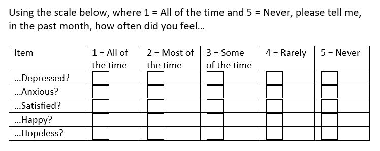

### About this site

#Note to Self: Include fig_caption: yes in YAML and {r figure_x, echo = FALSE, fig.cap = "Figure 1. Test", out.width = '100%'} knitr::include_graphics("images/figure5.jpg") in code chuck for figure captions and image insert

#Note to Self: To include images in HTML output, use code chunk start r resume, echo = FALSE, out.width = "75%", out.extra='style="background-color: #000000; padding:1px; display: inline-block;"'}
# code chunk end