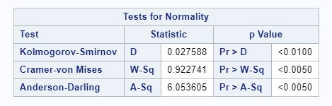

### About this site

#Note to Self: Include fig_caption: yes in YAML and {r figure_x, echo = FALSE, fig.cap = "Figure 1. Test", out.width = '100%'}  in code chuck for figure captions and image insert