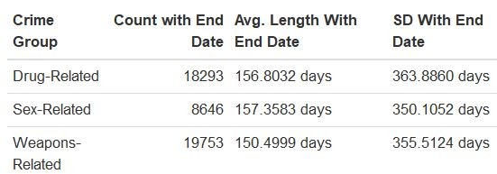
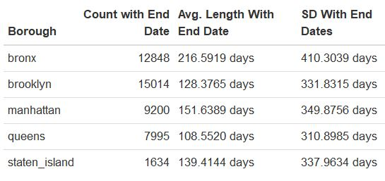

<br>

<style>
.list-group-item.active, .list-group-item.active:focus, .list-group-item.active:hover {
    background-color: #337ab7;
}

.navbar-default .navbar-collapse, .navbar-default .navbar-form {
background-color: #337ab7;
}

#Drop-Down Menu Color
.navbar-default .navbar-nav>.open>a, .navbar-default .navbar-nav>.open>a:focus, .navbar-default .navbar-nav>.open>a:hover {
background-color: #337ab7;
}

.navbar-default {
background-color: #337ab7;
}

.navbar-default .navbar-nav>li>a {
color: white;
font-weight: bold;
}

.navbar-default .navbar-brand {
color: white;
font-weight: bold;
}

</style>

<script>
$(document).ready(function() {
  $items = $('div#TOC li');
  $items.each(function(idx) {
    num_ul = $(this).parentsUntil('#TOC').length;
    $(this).css({'text-indent': num_ul * 10, 'padding-left': 0});
  });

});
</script>

##Differences in Mean Length of NYC Felonies

<br>

###Skills 

* Data Analysis
* ANOVA
* R
* Statistical Analysis

```{r setup, include = FALSE}
knitr::opts_chunk$set(
 echo = TRUE,
 out.width = "100%"
)

library(tidyverse)
library(dunn.test)
library(car)
```

<br>

###Introduction

In the ["Exploring NYC Crime Data Using EDA"](exploratory2.html) exploratory data analysis, we found that the average length of time of reported crime (i.e., time between when it started and when it ended) differed by felony type (sex-related, drug-related, and weapons-related), as well as by borough in NYC.

We now want to test whether these differences are statistically significant. Testing this difference can yield important insights regarding whether there is a disproportionate amount of felonies occurring in a certain borough. Finding a significant result may also suggest that certain felonies are more extensive and complicated, potentially more dangerous or violent, or may require more resources to deal with. Lastly, it may indicate that certain types of victims (e.g., victims of sex trafficking) are at a higher risk compared to those involved in other types of felonies.

<br>

###Data and Methods

Results from the exploratory data analysis are included below. We notice that sex-related felonies last the longest, on average; compared to the other boroughs, Bronx reports the longest felonies, on average. Note that this statistical analysis uses data with missing end dates inputted as the last day of 2017, which was the last year of recorded data. Also, we used Manhattan as the reference borough and drug-related felonies as the reference felony.

Figure 1: Mean Length of Felonies by Crime Group <br>
 

<br>

Figure 2: Mean Length of Felonies by Borough <br>
 

See the exploratory data analysis project related to this for fuller details regarding how the data were cleaned.

<br> 

### Results

####Differences by Felony Type

```{r import_data, include = FALSE}
felonies = readRDS(file = "./data/sex_drug_weapons.rds")

time_data = felonies %>%
  mutate(crime_group = forcats::fct_relevel(crime_group, "Drug-Related"),
         boro_nm = forcats::fct_relevel(boro_nm, "manhattan")) %>% 
  janitor::clean_names() %>% 
  mutate(time_diff2 = (as.numeric(cmplnt_to_dt - cmplnt_fr_dt, units = "days", 
                       na.rm = TRUE))) %>% 
  mutate(time_diff2 = if_else(is.na(time_diff2), as.Date("2017-12-31") 
         - as.Date(cmplnt_fr_dt), time_diff2)) %>%   
  select(time_diff2, boro_nm, crime_group)
```

We first test whether there is a difference in average length of crime by felony. Since we are testing the difference in means between three groups, we can conduct an ANOVA test. To ensure that the assumptions of the ANOVA test are not violated, we first test for homogeneity of variances. We used Levene's test to test homogeneity of variances. We see from the results below that the p-value is greater than 0.05. Therefore, the assumption of homogenous variances is met. 

```{r levene_test_crime_group}
time_data$time_diff2 <- as.numeric(time_data$time_diff2)

leveneTest(time_diff2 ~ crime_group, data = time_data) %>% 
  broom::tidy() %>% 
  knitr::kable()
```

<br>

We can now proceed to use the ANOVA test. The results indicate that the p-value is greater than 0.05; thus, we have insufficient data to conclude that at least one of the mean lengths of crime differ by felony type.
```{r}
anova <- aov(time_diff2 ~ crime_group, data = time_data)
broom::tidy(anova)
```

<br>

####Differences by Borough

We now test whether there is a difference in average length of crime by borough. Again, to ensure that the assumptions of the ANOVA test are not violated, we first test for homogeneity of variances. We used Levene's test to test homogeneity of variances. We see from the results below that the p-value is less than 0.05. Therefore, the assumption of homogenous variances is not met. 
```{r levene_test_borough}
time_data$time_diff2 <- as.numeric(time_data$time_diff2)

leveneTest(time_diff2 ~ boro_nm, data = time_data) %>% 
  broom::tidy() %>% 
  knitr::kable()
```

We resort to using a non-parametric approach in detecting a difference of means among these five boroughs by utilizing the Kruskal-Wallis test. From the test below, we can see that the p-value is less that 0.05. We conclude that at the 5% level of significance, at least one of the average lengths of reported crimes (i.e., time between when the crime started and when it ended) is different among the five boroughs.
```{r kruskal_wallis_test}
kruskal.test(time_diff2 ~ boro_nm, data = time_data) %>% 
  broom::tidy() %>% 
  knitr::kable()
```

<br>

Since the Kruskal–Wallis test is significant, we now conduct a post-hoc analysis to determine which boroughs differ from each other. We use the Dunn test for the post-hoc analysis. From the test below, we can clearly see that the average length of felony is statistically different from borough to borough, except when you compare 1) Staten Island and Manhattan and 2) Staten Island and Brooklyn.

```{r dunn_test}
dunn.test(time_data$time_diff2, time_data$boro_nm, method = "bonferroni")
```

<br>

### Discussion

The results show that the average length of reported crimes does not statistically differ by felony type (p = 0.153). However, when we examine all felony types by borough, we notice that the average length of reported crimes does statistically differ by borough - we found statistical differences for each borough-borough comparison, except when comparing 1) Staten Island and Manhattan and 2) Staten Island and Brooklyn. All together, we do not have evidence suggesting that sex-related, weapons-related, or drug-related felonies have different mean lengths of crime; however, we have sufficient evidence to conclude that the length of felonies vary by borough, with the longest felonies occuring in the Bronx.

