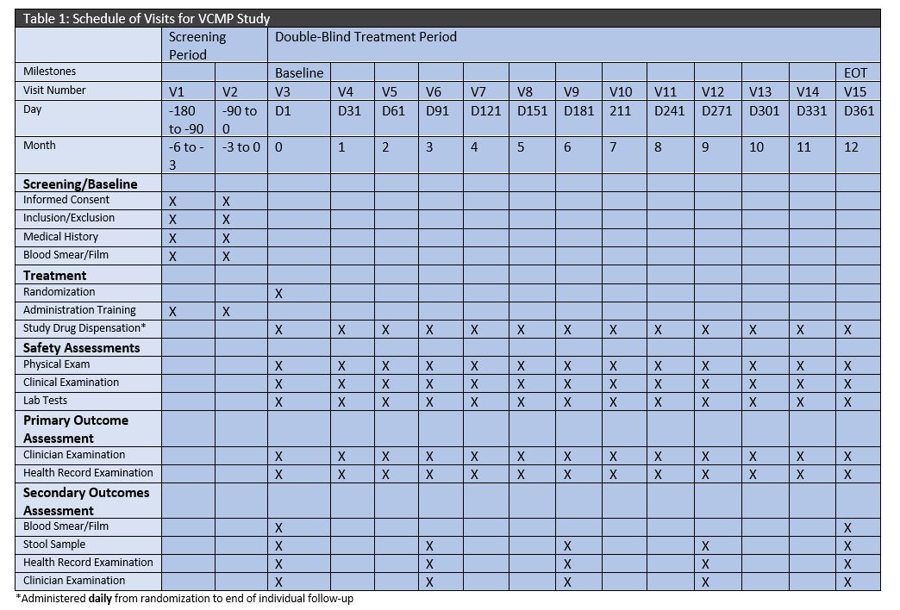
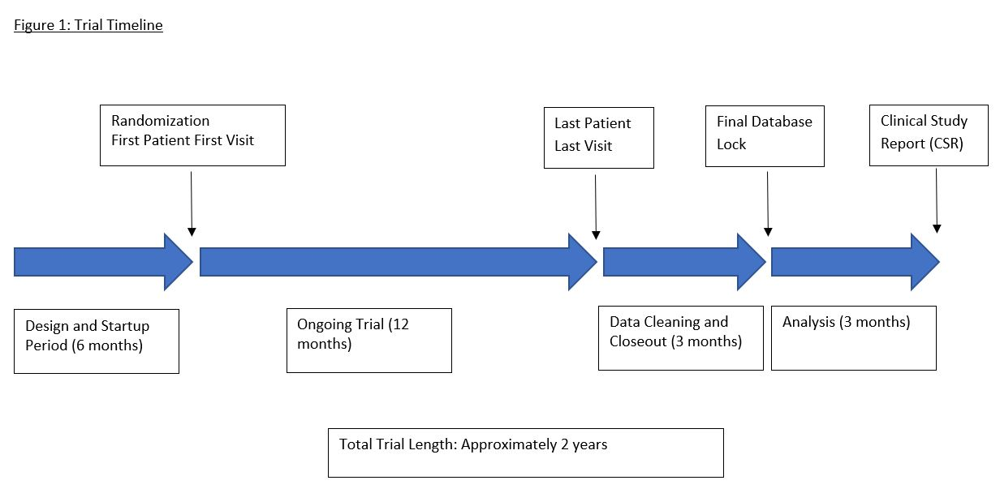

 

## Proposal for Phase III RCT: Vitamin C Supplementation and Malaria Prophylaxis (VCSMP Study)

 

###Skills 

* Research Report Writing
* Biostatistics
* Survival Analysis

 

###1.0 Introduction and Background
&nbsp;&nbsp;&nbsp;&nbsp;&nbsp;Malaria, caused by four different species of the protozoan parasite Plasmodium, is a debilitating disease that has caused a significant burden to millions of people around the world. The World Health Organization estimates that there were nearly 216 million malaria cases in 2016 and that approximately half a million people die every year due to the condition. Success of anti-malarial medication used for prevention of the disease (i.e., prophylaxis) currently varies — prophylaxis efficacy depends largely on the population that is affected (e.g., age), the Plasmodium parasites that are endemic to the particular region, and known presence of mosquito resistance to previous antimalarial medications. Some common anti-malarial prophylactic medication today includes Malarone, chloroquine, doxyclycline, tetracycline, and mefloquine. Due to increasing mosquito resistance to these drugs, however, researchers have been increasingly examining alternative prophylactic approaches as a means of halting the disease, including the usage of vitamins. Although existing research has looked at multi-vitamins, research has yet to examine the efficacy and benefit of Vitamin C and the current standard of care in Ghana.

&nbsp;&nbsp;&nbsp;&nbsp;&nbsp;I propose a Phase III two-parallel-group randomized clinical trial examining Ghananian individuals orally ingesting Vitamin C and the current standard of care (SoC) as the intervention group compared to those utilizing the standard of care alone as the control group. Specifically, in a sample of Ghanaian adults, I will examine whether oral self-administration of Vitamin C (at a daily dosage of 100 mg via 4 tablets) and Malarone (at a daily dosage of 1 gram atovaquone/400 mg proguanil via 4 adult-strength tablets) is superior in reducing malaria mortality over 1-year individual follow-up as compared to Malarone (at a daily dosage of 1 gram atovaquone/400 mg proguanil via 4 adult-strength tablets) alone. 

 

###2.0 Objectives

 

####i) Primary 
&nbsp;&nbsp;&nbsp;&nbsp;&nbsp;The primary H~0~ is that Vitamin C supplementation and SoC do not differ in reduction of mortality rates due to malaria compared to SoC alone at 5% significance level after 1-year individual follow-up. The primary H~A1~, and our hypothesis of clinical interest, is that Vitamin C supplementation and SoC are superior in reducing mortality rates due to malaria compared to SoC alone at the 5% significance level after 1-year individual follow-up. The primary H~A2~ is that SoC is superior in reducing mortality rates due to malaria compared to Vitamin C supplementation and SoC at the 5% significance level after 1-year individual follow-up.

 

####ii) Secondary
&nbsp;&nbsp;&nbsp;&nbsp;&nbsp;One key secondary outcome is hospitalization admissions. The secondary H~0~ is that Vitamin C and SoC do not differ in reducing hospitalization admissions due to malaria compared to SoC alone at 5% significance level after 1-year individual follow-up. The secondary H~A1~ is that Vitamin C supplementation and SoC are superior in reducing hospitalization admissions due to malaria compared to SoC alone at the 5% significance level after 1-year individual follow-up. 

&nbsp;&nbsp;&nbsp;&nbsp;&nbsp;Another key secondary outcome is parasitemia density in blood. The secondary H~0~ for this outcome is that Vitamin C and SoC do not differ in reducing parasitemia density levels in blood compared to SoC alone at 5% significance level after 1-year individual follow-up. The secondary H~A1~ for this outcome is that Vitamin C supplementation and SoC are superior in reducing parasitemia density levels in patients’ blood compared to SoC alone at the 5% significance level after 1-year individual follow-up.

&nbsp;&nbsp;&nbsp;&nbsp;&nbsp;A third key secondary outcome is incidence of diarrhea. The secondary H~0~ for this outcome is that Vitamin C and SoC do not differ in reducing incidences of diarrhea compared to SoC alone at 5% significance level after 1-year individual follow-up. The secondary H~A1~ for this outcome is that Vitamin C supplementation and SoC are superior in reducing incidences of diarrhea compared to SoC alone at the 5% significance level after 1-year individual follow-up.

 

####iii) Safety
&nbsp;&nbsp;&nbsp;&nbsp;&nbsp;One major safety outcome is sudden death or death due to unknown causes; this is a categorical outcome (death versus no death) that will be measured by health records from hospitals and clinician observation. This will be measured at interim parts of individual follow-up (monthly, for up to 12 months). Another major safety outcome is incidence of any respiratory diseases; this is a categorical outcome (any respiratory illness or none) that will be  measured and verified by clinician diagnosis and examination. Incidence of respiratory diseases will be measured at interim parts of individual follow-up (monthly for up to 12 months). A third safety outcome is number of febrile episodes; this is a continuous outcome also measured and verified by clinician diagnosis and examination. This outcome will be measured at interim parts of individual follow-up (monthly for up to 12 months).

 

###3.0 Trial Design

 

####i) RCT Features
&nbsp;&nbsp;&nbsp;&nbsp;&nbsp;The trial will be a Phase III two-parallel-group randomized clinical trial (RCT) and will incorporate the seven features inherent within an ideal RCT. Specifically, the trial will examine patients over time to determine whether they will ascertain the primary and secondary outcomes (prospective). The trial will include an intervention group comprising of individuals who will take both Vitamin C and Malarone (intervention). The trial will also include a control group comprising of individuals who will take Malarone (control). Patients enrolled in the study will be randomly allocated to either the intervention group or the control group via a computerized randomization program (randomization). The trial will utilize a double-blinding system (double-blinding). Furthermore, the trial will analyze every randomized patient in the group to which they were randomized, even if the patient withdrew from the study or was lost to follow-up (ITT primary analysis). Lastly, the trial will attempt to obtain reliable final outcome statuses for every randomized patient (complete follow-up).

 

####ii) Blinding
&nbsp;&nbsp;&nbsp;&nbsp;&nbsp;The trial will utilize a double-blinding system, in which both the patients and the researchers will be blinded to the treatment group that each patient is assigned. The intervention group will receive the intervention active tablets (active Vitamin C tablets) and open label standard-of-care (Malarone). The control group will receive the intervention placebo tablets (placebo Vitamin C tablets) and open label standard-of-care (Malarone). The intervention active and placebo tablets will be identical in appearance. Thus, although both groups will be aware that they are receiving Malarone, they will be unable to determine whether they are receiving the active or placebo Vitamin C tablets. Furthermore, researchers will take care to not disclose any information to any patient indicating which intervention group he or she is assigned.

&nbsp;&nbsp;&nbsp;&nbsp;&nbsp;In order to ensure blinding among researchers, several approaches will be utilized. First, data analysis will not be completed by the researchers; external data analysts will be utilized for the sole purpose of analyzing any associations and significant results among the gathered data. Also, data analysts will create two versions of the datasets: one for analytical purposes among themselves (which may contain personal identifiers) and a second version that will be stripped and de-identified as much as possible for the main researchers’ use. Lastly, the data will be sent and store using password protection (both electronically and hard copies). Double-blinding will maintain and preserve the benefits achieved by randomization, as bias is minimized during the duration of the trial. 

 

####iii) Randomization 
&nbsp;&nbsp;&nbsp;&nbsp;&nbsp;Patients will be randomly assigned to a treatment group using a computerized randomization program utilizing randomly permuted blocks. Using randomly permuted blocks prevents any of the researchers from figuring out what treatment arms some patients are assigned to, which is an issue for fixed block randomization. Because this trial will contain 20 sites, 20 separate randomized allocation lists must be created by the computerized randomization scheme to successfully randomize patients to their treatment arm across all sites.

&nbsp;&nbsp;&nbsp;&nbsp;&nbsp;Furthermore, patients will be stratified by site. Since different sites can vary tremendously in terms of potential confounders and other factors that may obscure results, it is critical to stratify by site so that randomization is balanced across all sites; in other words, stratifying by site prevents any site-specific issues from affecting the treatment effect in our trial. The trial will not stratify by any other variables, for several reasons. First, I want to minimize the potential for overstratifying, as doing so would underpower our trial and require a larger sample size (e.g, more sites) for our trial. This, in turn, increases costs and burden. Second, overall randomization beforehand already adjusts for imbalances between known and unknown confounders, so stratifying by factors in addition to site is often not necessary. Lastly, stratifying solely by site keeps the randomization lists per site minimal and easily manageable. Stratification will occur prior to blocking. 

 

####iv) Inclusion and Exclusion Criteria 
&nbsp;&nbsp;&nbsp;&nbsp;&nbsp;Inclusion Criteria: Individuals must 1) Be born in Ghana; 2) Be a current resident of Ghana; 3) Be aged 21-65; 4) Not have a history of uncomplicated or severe malaria; 5) Not currently have uncomplicated or severe malaria; 6) Not be taking any other vitamin supplements

&nbsp;&nbsp;&nbsp;&nbsp;&nbsp;Regarding the inclusion criteria, it is critical that patients do not currently have uncomplicated or severe malaria, as this is the outcome that we are examining in this trial. Furthermore, patients should not have a history of uncomplicated or severe malaria, as malaria caused by certain Plasmodium parasites can remain dormant in their bodies and re-emerge at a later point in life, which would complicate study results. Lastly, individuals must be aged 21-65 because the trial is focused on examining treatment effects on Ghananian adults as opposed to children.  

&nbsp;&nbsp;&nbsp;&nbsp;&nbsp;Exclusion criteria: 1) Individuals who are pregnant; 2) Individuals with any contraindications to Malarone administration; 3) Individuals with any contraindications to Vitamin C administration; 4) Individuals who have current malaria (uncomplicated or severe); 5) Individuals who have a history of malaria (uncomplicated or severe); 6) Individuals with anemia; 7) Individuals who are malnourished, defined as being underweight when using BMI as the measure; 6) Individuals who were not born in Ghana

&nbsp;&nbsp;&nbsp;&nbsp;&nbsp;Regarding the exclusion criteria, individuals who are pregnant may not participate as they represent a vulnerable study population and are not the focus of this trial. Furthermore, individuals with contraindications to either Malarone or Vitamin C cannot participate, as this trial explicitly utilizes Malarone and Vitamin C and may pose a harmful risk for these individuals. Studies have shown that anemia may have a protective effect on malarial outcomes and effects; therefore, individuals with such a condition cannot participate in this trial. Lastly, individuals who are malnourished cannot participate, as malnourishment is a risk factor for malaria. Malnourishment for this trial will be broadly defined via BMI (a common and easy measure of general physical health status) – any potential participant who is underweight will be excluded from the study. 

 

####v) Enrolling Centers
&nbsp;&nbsp;&nbsp;&nbsp;&nbsp;The trial will recruit and enroll participants from medical centers, hospitals, and clinics. Doctors in Ghana will be asked to notify patients who meet the inclusion criteria to contact the research team if they are interested in participating, whereby they will be further screened to more accurately determine their eligibility for the study. We expect approximately 20 sites for this trial. 

 

####vi) Data Coordination and Trial Management 
&nbsp;&nbsp;&nbsp;&nbsp;&nbsp;For this trial, there will be a Data Coordinating Center (DCC) and Clinical Trial Management (CTM) resources at a level appropriate for the proposed trial. A DCC is responsible for the collection, storage, and maintenance of data obtained from a multi-site trial. A CTM is a system and process by which researchers are able to logistically and operationally manage and carry out essential functions and duties of a clinical trial. Because this is a proposed multi-site trial, both the DCC and CTM will be critical assets for the researchers in order for the trial to run smoothly. The DCC must have the capability to manage and sift through large amounts of data across multiple locations, maintain clear and constant communication regarding any data inconsistencies and issues with the researchers, contain experienced data managers and trial coordinators with exceptional organizational skills, and work extensively to protect and secure the data. A CTM must streamline the entire trial process smoothly, adequately help the research team plan and process various duties and functions pertinent to the success of the trial, and help the team manage their work flow. 

 

####vii) Sidedness of Test
&nbsp;&nbsp;&nbsp;&nbsp;&nbsp;The primary outcome for this trial will utilize a two-sided test. The alternate hypotheses for the primary outcome are 1) Vitamin C supplementation and SoC are superior in reducing mortality rates due to malaria compared to SoC alone at the 5% significance level after 1-year individual follow-up and 2) SoC is superior in reducing mortality rates due to malaria compared to Vitamin C supplementation and SoC at the 5% significance level after 1-year individual follow-up. Because these alternate hypotheses) go in opposite directions (Vitamin C + SoC > SoC  or  SoC > Vitamin C + SoC, a two-sided test allows alpha testing for either direction. 

 

###4.0 Data Collection and Patient Follow-up

 

####i) Outcome Details 
&nbsp;&nbsp;&nbsp;&nbsp;&nbsp;The primary patient important outcome is mortality due to malaria (cause-specific). There is no specific instrument to determine malaria-specific mortality – researchers would have to use health records from medical centers, hospitals, and clinics, as well as confirmation from clinicians, to make a sound judgment for this outcome; clinicians will typically look at serious organ dysfunctions or failures and abnormalities in the blood as clear-cut indications of malaria-associated mortality in severe malaria. This outcome will be statistically studied as a time-to-event outcome, and will be measured continuously in a laboratory or clinic setting. Data collectors and coordinators will transcribe information from health records or from clinicians onto their data forms regarding whether mortality was caused by malaria for any patients who died in that past month.  

&nbsp;&nbsp;&nbsp;&nbsp;&nbsp;The secondary outcome would be hospitalization admissions due to malaria-associated symptoms. Again, there are no specific instruments to determine whether hospitalization admission is due to malaria-associated symptoms; instead, researchers would have to depend on clinicians’ examinations and diagnoses, as well as health records from medical centers, hospitals, and clinics, in order to determine whether there are cases of malaria-associated hospitalization. This secondary outcome would be categorical-binary (hospitalization versus no hospitalization) and will be measured every three months (for up to 12 months) in a clinic or hospital setting. Data collectors and coordinators will transcribe information from health records or from clinicians onto their data forms regarding whether cause of the hospital admission was malaria-associated. 

&nbsp;&nbsp;&nbsp;&nbsp;&nbsp;Another secondary outcome is incidence of diarrhea. The Bristol stool scale is an instrument commonly used to assess the incidence of diarrhea. The instrument asks the patient whether he or she has had the passage of three or more loose or liquid stools per day, or more frequently than is normal for the individual. The instrument accurately reflects the outcome of interest as it standardizes the definition of loose and liquid stool via images of different types of stool, and is a validated instrument as it is often used in clinical diagnostic settings. The outcome is categorical-binary (presence of diarrhea or no presence) and will be measured every three months in a clinic or hospital setting, after the study drug administration on that day of that month. Data collectors and coordinators will communicate with clinicians to assess whether there was presence of diarrhea on that day and transcribe this information onto their data forms. 

&nbsp;&nbsp;&nbsp;&nbsp;&nbsp;Another secondary outcome is parasitemia density in blood. Microscopy, in combination with the usage of thin or thick blood films, is used to measure parasitemia density in the blood, although the use of thick blood films is typically the gold standard in determining presence of malarial parasites. Microscopy accurately reflects the secondary outcome of interest because it visibly assesses the number of malarial parasites per blood sample, and thick blood films is considered to be the gold standard because it is the most useful approach for detecting parasites given that it involves a larger sample of blood compared to a thin blood film. This outcome is continuous (number of parasites in a given blood sample) and will be measured at baseline and at the end of the treatment period in a laboratory setting. Data collectors and coordinators need to collect blood samples from patients, have a lab conduct a blood test using microscopy, and transcribe the parasite count onto their data forms.

 

####ii) Data Collection Mechanism 
&nbsp;&nbsp;&nbsp;&nbsp;&nbsp;Data will be collected via a web-based management system with Electronic Case Report Forms (eCRFs). This system will entail data collectors securely logging in and submitting their forms to the system (or entering the data manually should any issues or bugs occur). Data collectors should ensure that data forms and files are entered into the system as soon as possible after each monthly patient visit. Data collectors should also ensure that clinician examinations and diagnoses, as well as laboratory findings, are accurately reported in the system. 

 

####iii) Schedule of Visits
A table detailing a schedule of visits for each patient enrolled is included below.

Table 1. Schedule of Visits  

 

####iv) Trial Timeline
A figure detailing the trial timeline, including length of time needed for startup before randomization, randomization, total (not individual) follow-up time, data cleaning, and statistical analysis is included below.

Figure 1. Study Timeline  

 

###5.0 Statistical Considerations

 

####i) Type of Outcome
&nbsp;&nbsp;&nbsp;&nbsp;&nbsp;The primary null hypothesis is proportions of mortality (i.e., mortality rates), which is a dichotomous variable. We compare this measure by looking at proportions of mortality between the two groups and test the hypothesis by using the CMH test. The statistical design is superiority, the experiment-wide Type I error rate is 5%, and the test is two-sided.  

 

####ii) Power Calculation: Unadjusted and Adjusted Effect Size  
&nbsp;&nbsp;&nbsp;&nbsp;&nbsp;According to Owusu-Agyei et al., the effect size for a similar study examining Vitamin A and zinc supplementation as opposed to zinc alone in reducing the incidence of clinical malaria was 20%. Another study by Sazawal et al. estimated the effect size for a study examining the effect of iron and zinc supplementation between the intervention and control group in reducing overall mortality rates was 20%. Other studies used an estimated effect size of 30% (malaria rate reduction) and 50% (number of clinical malaria episodes). Thus, the unadjusted effect size to use for this trial to determine the least clinically meaningful effect size will be 20%, based on previous research. The adjusted effect size is 0.62-0.78= -0.16. For a calculation of this adjusted effect size, please refer to Appendix A.

####iii) Sample Size 
&nbsp;&nbsp;&nbsp;&nbsp;&nbsp;I would need a total sample size of 336 (1:1 allocation ratio) in order to obtain a power of 0.90 with the adjusted effect size of -0.18 at a 5% significance level. I used the PASS software in order to calculate the sample size. 

