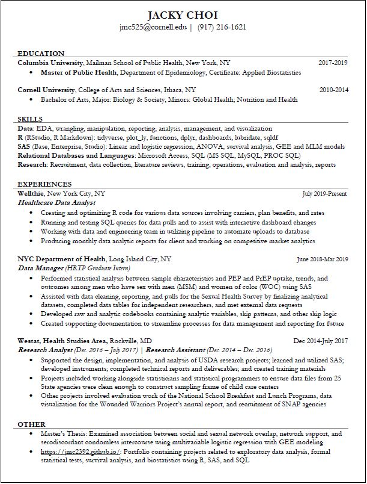

<br>

<style>
.list-group-item.active, .list-group-item.active:focus, .list-group-item.active:hover {
    background-color: #337ab7;
}

.navbar-default .navbar-collapse, .navbar-default .navbar-form {
background-color: #337ab7;
}

#Drop-Down Menu Color
.navbar-default .navbar-nav>.open>a, .navbar-default .navbar-nav>.open>a:focus, .navbar-default .navbar-nav>.open>a:hover {
background-color: #337ab7;
}

.navbar-default {
background-color: #337ab7;
}

.navbar-default .navbar-nav>li>a {
color: white;
font-weight: bold;
}

.navbar-default .navbar-brand {
color: white;
font-weight: bold;
}

</style>

<br>
```{r resume, echo = FALSE, out.width = '100%'}

```


