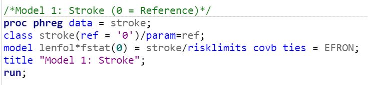
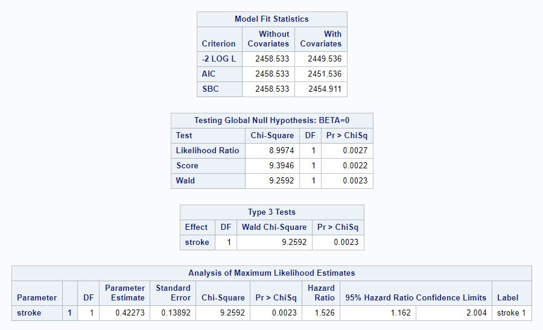
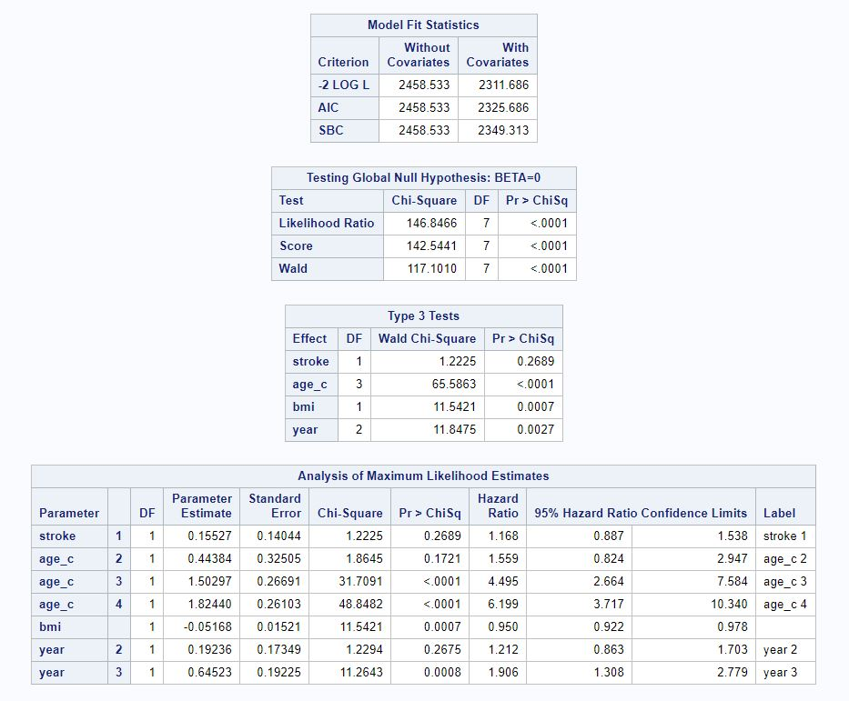
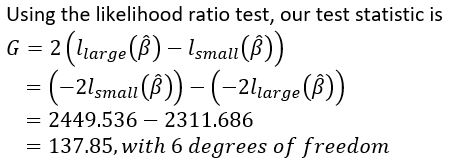
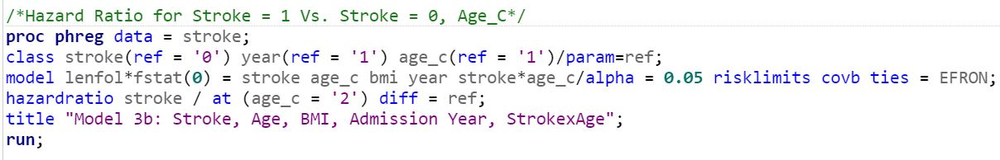
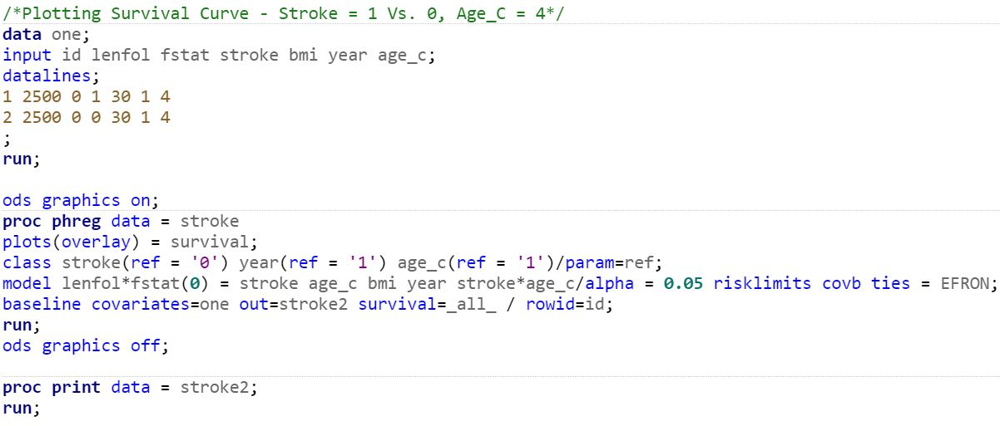

<br>

<style>
.list-group-item.active, .list-group-item.active:focus, .list-group-item.active:hover {
    background-color: #337ab7;
}

.navbar-default .navbar-collapse, .navbar-default .navbar-form {
background-color: #337ab7;
}

#Drop-Down Menu Color
.navbar-default .navbar-nav>.open>a, .navbar-default .navbar-nav>.open>a:focus, .navbar-default .navbar-nav>.open>a:hover {
background-color: #337ab7;
}

.navbar-default {
background-color: #337ab7;
}

.navbar-default .navbar-nav>li>a {
color: white;
font-weight: bold;
}

.navbar-default .navbar-brand {
color: white;
font-weight: bold;
}

</style>

<script>
$(document).ready(function() {
  $items = $('div#TOC li');
  $items.each(function(idx) {
    num_ul = $(this).parentsUntil('#TOC').length;
    $(this).css({'text-indent': num_ul * 10, 'padding-left': 0});
  });

});
</script>

##Survival Analysis of Stroke Patients

<br>

###Skills 

* Survival Analysis
* R
* SAS
* Model Fitting

<br>

```{r setup, include=FALSE}
knitr::opts_chunk$set(
 echo = TRUE,
 out.width = "100%",
 out.extra='style="background-color: #000000; padding:1px"'
 
)

library(tidyverse)
library(skimr)
library(pixiedust)
library(broom)
```


###Introduction

The [stroke_data.csv](data/stroke_data.csv) files provides the time until death (in days) for 500 patients following
their hospital admission for incidences of stroke. For this analysis, we are interested in whether the rate of death is different between patients who experienced a stroke for the first time and those who have had a recurrent stroke. The number of days from hospital admission to last follow-up, as well as their vital status was recorded. Other variables, such as age, BMI, and year of admission into the hospital were also recorded. The variables (from left to right) are:

<p> `ID` = Patient ID <br> <p>
`lenfol` = Days from Hospital Admission Date to Date of Last Follow-up <br> <p>
`fstat` = Vital Status at Last Follow-up <br> <p>
* 0 - Alive
* 1 - Dead <br>

<p> `stroke` = Stroke Type <br> <p>
* 0 - First
* 1 - Recurrent <br>

`bmi` = Body Mass Index <br>

<p> `year` = Admission Year <br> <p>
* 1 - 1997
* 2 - 1999
* 3 - 2001

<p> `age_c` = Age at Hospital Admission <br> <p>
* 1 - age < 60
* 2 - 60 `r expression("\u2264")` age < 70
* 3 - 70 `r expression("\u2264")` age < 80
* 4 - `r expression("\u2265")` 80

<br>

###Model Fitting - SAS

<br>

####Model 1

We first fit a Cox model with stroke recurrence as the only covariate (Model 1) and examine whether the rate of death is different between patients experiencing stroke for the first time and those experiencing a recurrent stroke at an alpha level of 0.05. The model statement is given below:

Model 1 (Stroke) Statement: ℎ(t,*x*,B) = h~0~(t)exp(B~1~*x*~1~) where <br>

*x*~1~ = (1 if Recurrent Stroke <br>
&nbsp;&nbsp;&nbsp;&nbsp;&nbsp;&nbsp;&nbsp;&nbsp;0 if First-Time Stroke)

From the SAS output below, we can see that the Wald test statistic is 9.2592; the Pr(*x*^2^~1~ `r expression("\u2265")`9.2592) = 0.0023, which is less than alpha level of 0.05. Thus, at the 5% significance level, we reject the null hypothesis; there is sufficient data on hand to conclude that the rate of death between patients with first time incident stroke and recurrent stroke is statistically different.

Figure 1: SAS Code and Output for Model 1 <br>
```{r strokefig_sas}

```
<br>

```{r strokefig}

```

<br>

####Model 2

We next fit a multivariate Cox model with age, BMI, and admission year as additional covariates. Patients aged less than 60 with first-time strokes admitted to the hospital in 1997 were used as the reference category. The model statement is given below:

Model 2 (Stroke, Age, BMI, Admission Year) Statement: h~0~(t)exp(B~1~*x*~1~ + B~2~*x*~2~ + B~3~*x*~3~ + B~4~*x*~4~ + B~5~*x*~5~ + B~6~*x*~6~ + B~7~*x*~7~) where <br>

*x*~1~ = (1 if Recurrent Stroke <br>
&nbsp;&nbsp;&nbsp;&nbsp;&nbsp;&nbsp;&nbsp;&nbsp;(0 if First-Time Stroke <br>


*x*~2~ = (1 if 60 `r expression("\u2264")` age < 70 <br>
&nbsp;&nbsp;&nbsp;&nbsp;&nbsp;&nbsp;&nbsp;&nbsp;(0 if otherwise <br>


*x*~3~ = (1 if 70 `r expression("\u2264")` age < 80 <br>
&nbsp;&nbsp;&nbsp;&nbsp;&nbsp;&nbsp;&nbsp;&nbsp;(0 if otherwise <br>

*x*~4~ = (1 if age `r expression("\u2265")` 80 <br>
&nbsp;&nbsp;&nbsp;&nbsp;&nbsp;&nbsp;&nbsp;&nbsp;(0 if otherwise <br>

*x*~5~ = BMI <br>

*x*~6~ = (1 if admission year = 1999 <br>
&nbsp;&nbsp;&nbsp;&nbsp;&nbsp;&nbsp;&nbsp;&nbsp;(0 if otherwise <br>

*x*~7~ = (1 if if admission year = 2001 <br>
&nbsp;&nbsp;&nbsp;&nbsp;&nbsp;&nbsp;&nbsp;&nbsp;(0 if otherwise <br>

From the SAS output below, we can see that the Wald test statistic is 1.2225; the Pr(*x*^2^~7~ `r expression("\u2265")`1.2225) = 0.2689, which is greater than alpha level of 0.05. Thus, at the 5% significance level, we fail to reject the null hypothesis; there is insufficient data on hand to conclude that the rate of death between patients with first time incident stroke and recurrent stroke is statistically different, after adjusting for age, BMI, and admission year.

Figure 2: SAS Code and Output for Model 2 <br>
```{r strokefig2_sas}
knitr::include_graphics('images2/strokefig2_sas.JPG')
```

<br>

```{r strokefig2}

```

<br>

#####Likelihood Ratio Test

Using the partial likelihood ratios from Model 1 and Model 2, we can determine whether Model 2 is a signficantly better fit than Model 1, by subtracting the partial likelihood for the larger model from that for the smaller model (Figure 3). Pr(*x*^2^~6~ `r expression("\u2265")` 137.85) < 0.05 (using a chi-squared distribution table) is less than alpha level of 0.05. Thus, at the 5% significance level, there is sufficient data on hand to conclude that Model 2 is a significantly better fit than Model 1.

Figure 3: Testing Model 1 and Model 2 Fit <br>
```{r model2_lr, out.width = '55%'}

```

<br>

####Model 3 
We hypothesize that recurrence of stroke varies by age of the patient. Therefore, we now fit a multivariate Cox model with stroke recurrence, age, BMI, admission year as covariates, along with an interaction term between stroke recurrence and age. Again, patients aged less than 60 with first-time strokes admitted to the hospital in 1997 were used as the reference category. The model statement is given below:

Model 3 (Stroke, Age, BMI, Admission Year, StrokexAge) Statement: h~0~(t)exp(B~1~*x*~1~ + B~2~*x*~2~ + B~3~*x*~3~ + B~4~*x*~4~ + B~5~*x*~5~ + B~6~*x*~6~ + B~7~*x*~7~ + B~8~*x*~1~*x*~2~ + B~9~*x*~1~*x*~3~ + B~10~*x*~1~*x*~4~) where <br>

*x*~1~ = (1 if Recurrent Stroke <br>
&nbsp;&nbsp;&nbsp;&nbsp;&nbsp;&nbsp;&nbsp;&nbsp;(0 if First-Time Stroke <br>


*x*~2~ = (1 if 60 `r expression("\u2264")` age < 70 <br>
&nbsp;&nbsp;&nbsp;&nbsp;&nbsp;&nbsp;&nbsp;&nbsp;(0 if otherwise <br>


*x*~3~ = (1 if 70 `r expression("\u2264")` age < 80 <br>
&nbsp;&nbsp;&nbsp;&nbsp;&nbsp;&nbsp;&nbsp;&nbsp;(0 if otherwise <br>

*x*~4~ = (1 if age `r expression("\u2265")` 80 <br>
&nbsp;&nbsp;&nbsp;&nbsp;&nbsp;&nbsp;&nbsp;&nbsp;(0 if otherwise <br>

*x*~5~ = BMI <br>

*x*~6~ = (1 if admission year = 1999 <br>
&nbsp;&nbsp;&nbsp;&nbsp;&nbsp;&nbsp;&nbsp;&nbsp;(0 if otherwise <br>

*x*~7~ = (1 if if admission year = 2001 <br>
&nbsp;&nbsp;&nbsp;&nbsp;&nbsp;&nbsp;&nbsp;&nbsp;(0 if otherwise <br>

From the SAS output below, we can see that the Wald test statistic is 4.4958; the Pr(*x*^2^~10~ `r expression("\u2265")`4.4958) = 0.034, which is less than alpha level of 0.05. Thus, at the 5% significance level, we reject the null hypothesis; there is sufficient data on hand to conclude that the rate of death between patients with first time incident stroke and recurrent stroke is statistically different, after adjusting for age, BMI, admission year, and an interaction term between stroke recurrence and age.

Figure 4: SAS Code and Output for Model 3 <br>
```{r strokefig3_sas}
knitr::include_graphics('images2/strokefig3_sas.JPG')
```

<br>

```{r strokefig3}
knitr::include_graphics('images2/strokefig3.JPG')
```

<br>

#####Likelihood Ratio Test

Using the partial likelihood ratios from Model 2 and Model 3, we can determine whether Model 3 is a signficantly better fit than Model 2, by subtracting the partial likelihood for the larger model from that for the smaller model (Figure 5). Pr(*x*^2^~3~ `r expression("\u2265")` 14.594) < 0.05 (using a chi-squared distribution table) is less than alpha level of 0.05. Thus, at the 5% significance level, there is sufficient data on hand to conclude that Model 3 is a significantly better fit than Model 2.

Figure 5: Testing Model 2 and Model 3 Fit <br>
```{r model3_lr, out.width = '55%'}
knitr::include_graphics('images2/model3_lr.JPG')
```

<br>

#####Testing PH Assumption

Before we proceed with plotting the survival curves and making predictions for certain patients, we quickly check that the proportional hazards assumption holds for Model 3. The SAS output below shows that the predictors in our model meet the PH assumption.

Figure 6: Testing for PH Assumption <br>
```{r phassume, out.width = '55%'}
knitr::include_graphics('images2/phassume.JPG')
```

<br>

####Predictions and Survival Curves

Using Model 3, we can make predict the hazard (i.e., rate) of death for patients with any given covariate.

For example, the estimated hazard ratio for a patient aged 60 to 70 who experienced recurrrent stroke compared to a patient of the same age who experienced stroke for the first time is 4.556 - that is, the rate of death for a patient aged 60 to 70 who experienced recurrent stroke is 4.556 times that for a patient of the same age who experienced stroke for the first time, after controlling for BMI, admission year, and the interaction term between stroke recurrence and age. The SAS code and output are show below.

Figure 7: Hazard Ratio for Stroke = 1 Vs. 0, Age_C = 2
```{r strokefig4_sas}

```

<br>

```{r strokefig4}
knitr::include_graphics('images2/strokefig4.JPG')
```

<br>

Lastly, we can predict survival curves with our model and estimate the probability of survival after a certain time point (or death up to a given time point). Using the SAS code below, we plot the survival functions of a patient aged 80 or older who experienced recurrent stroke with BMI = 30 admitted in 1997, and a patient aged 80 or older who experienced stroke for the first time with BMI = 30 admitted in 1997.

Figure 8: Survival Curves for Stroke = 1 Vs. 0, Age_C = 4
```{r strokefig5_sas}

```

<br>

```{r strokefig5}
knitr::include_graphics('images2/strokefig5.JPG')
```

<br>

###Model Fitting - R

We now try to reproduce our models above using R. We first import the dataset and include the column names. From the output below, we can see that the code successfully imported and tidied the data.

```{r import_data}
library("survival")
library("survminer")
library("ggplot2")
library("broom")
library("pixiedust")

stroke <- read.csv("data/stroke_data.csv", header = FALSE)
colnames(stroke) <- (c("id", "lenfol", "fstat", "stroke", "bmi", "year", "age_c"))

knitr::kable(head(stroke))
```

<br>

####Model 1

As shown below, our univariate Cox model gives us identical results to those derived for Model 1 using SAS. The beta coefficient for our stroke variable is 0.4227; exponentiating the value gives us 1.526, indicating that the rate of death for patients who experienced a recurrent stroke is 1.526 times the rate for those who experienced a stroke for the first time. Note that R provided a z test statistic instead of the Wald Chi-Square test statistic derived from Model 1 using SAS; we can square the z test statistic and confirm that the result matches the Wald Chi-Square test statistic. Lastly, the p-value is also identical.

Figure 9: Model 1 Using R <br>
```{r model1}
model1 <- coxph(Surv(lenfol, fstat) ~ stroke, data = stroke)
summary(model1)
```

<br>

####Model 2

We next fit a multivariate Cox model with age, BMI, and admission year as additional covariates. We include "factor" in our code for any multi-level categorical variables; note that we also have the option of changing our reference category for any categorical predictors by using `relevel(factor( ), ref = ' ')`. 

From the R output below, we can see that the z test statistic is 1.106; the Pr(|z| `r expression("\u2265")`1.106) = 0.2689, which is greater than alpha level of 0.05. Thus, at the 5% significance level, we fail to reject the null hypothesis; there is insufficient data on hand to conclude that the rate of death between patients with first time incident stroke and recurrent stroke is statistically different, after adjusting for age, BMI, and admission year. These results are identical to those derived from Model 2 using SAS. Note that the likeihood ratio test results provided below only test whether the current model is a better fit than the null model.

Figure 10: Model 2 Using R <br>
```{r model2}
model2 <- coxph(Surv(lenfol, fstat) ~ stroke + factor(age_c) + bmi + factor(year), data = stroke)
summary(model2)
```

<br>

####Model 3

We hypothesize that recurrence of stroke varies by age of the patient. Therefore, we now fit a multivariate Cox model with stroke recurrence, age, BMI, admission year as covariates, along with an interaction term between stroke recurrence and age. From the R output below, we can see that the z test statistic is 2.12; the Pr(|z| `r expression("\u2265")`2.12) = 0.034, which is less than alpha level of 0.05. Thus, at the 5% significance level, we reject the null hypothesis; there is sufficient data on hand to conclude that the rate of death between patients with first time incident stroke and recurrent stroke is statistically different, after adjusting for age, BMI, admission year, and an interaction term between stroke recurrence and age. The rate of death for those experiencing a recurrent stroke is 2.7085 times the rate of death for those experiecing a first-time stroke, after adjusting for age, BMI, admission year, and an interaction term between stroke recurrence and age.

Figure 11: Model 3 Using R <br>
```{r model3}
model3 <- coxph(Surv(lenfol, fstat) ~ stroke + factor(age_c) + bmi + factor(year) + stroke*factor(age_c), data = stroke)
summary(model3)
```

<br>

#####Testing PH Assumption

We run the code below to see of the PH assumption is violated. Since p-values are above 0.05, this indicates that the PH assumption was not violated.

Figure 12: Testing PH Assumption <br>
```{r test_ph_assumption}
cox.zph(model3)
```

<br>

####Predictions and Survival Curves

Below, I plot the average survival curve for the patients (by default, covariates are assigned mean values).

Figure 13: Average Survival Curve <br>
```{r survival_curves}
ggsurvplot(survfit(model3), data = stroke,  ylab = "Survival Probability", title = "Model 3 - Survival Curve", 
           palette = c("#075CA7"), ggtheme = theme_classic2(), legend = "bottom")
```

<br>

Lastly, we can predict survival curves with our model and estimate the probability of survival after a certain time point (or death up to a given time point). Using the R code below, we plot the survival functions of a patient aged 80 or older who experienced recurrent stroke with BMI = 30 admitted in 1997, and a patient aged 80 or older who experienced stroke for the first time with BMI = 30 admitted in 1997. Note that you can use the code `summary(newmodel)` to view the median survival times shown in the plot below (as well as other survival probabilities); for SAS, the equivalent code above would be `proc print data = stroke2; run` (Figure 8).
```{r predicted_survivals}
new_df <- with(stroke, data.frame(id = c(1, 2), 
                                  fstat = c(1, 2), 
                                  stroke = c(1, 0),
                                  bmi = c(30, 30),
                                  year = c(1, 1),
                                  age_c = c(4, 4)))

new_df

newmodel <- survfit(model3, newdata = new_df, data = stroke)

ggsurvplot(newmodel, conf.int = FALSE, palette = c("#075CA7", '#ff0000'), surv.median.line = "hv", legend.labs = c("ID=1", "ID=2"))
```


𝑟𝑤𝑖𝑠𝑒