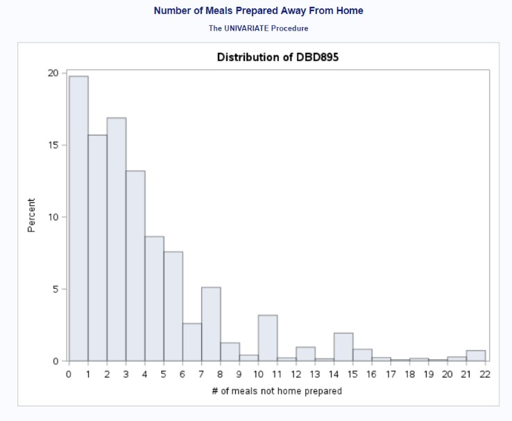

---
title: ""
output:
  html_document:
    toc: true
    toc_float:
      collapsed: false
---

 

## Away-From-Home Meals and Body Mass Index in the NHANES Dataset

 

###Skills 

* Data Analysis
* Linear Regression
* Model Fitting
* Research Report Writing
* SAS

 

###Background
&nbsp;&nbsp;&nbsp;&nbsp;&nbsp;Obesity - one of the most complex public health issue facing our country today - in the United States reached 39.8% for the adult population in 2015-2016; it is associated with an increased risk for reduced quality of life and is a precursor to many other serious health conditions. It results from a combination of factors, including individual behavior - specifically, dietary behavior and patterns have been noted as important predictors of obesity. Indeed, it has been reported that Americans’ food consumption has shifted to incorporate more food prepared outside the home, becoming close to one-third of an individual’s daily dietary intake. At the same time, nutritional quality in diets has decreased while overall calorie counts have increased. As American adults eat more meals prepared away from home, researchers have suggested that poor diet may partly be a culprit for this epidemic.

Figure 1: Distribution of DBD895  

Figure 2: Frequency of Various Moods Survey Question  

